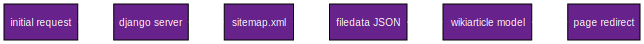

# utils/djangopwa/docs

### Motivation

The design is an attempt at using the [Model-view-viewmodel Paradigm](https://en.wikipedia.org/w/index.php?title=Model%E2%80%93view%E2%80%93viewmodel&oldid=1344184593)

The Paradigm will partition the user interface, the data preprocessing before display, and backend business logic from one another. This modularity allows for cleaner abstraction of information and control flows. 

The view is what the speaking subject sees. The viewmodel is the unconscious processing within the client. The model is the unconscious processing on the server. An ideal model can be used by any system of view and viewmodel. The set theoretic constructive properties of a viewmodel should be expressible in any programming language. The framework specific properties of the view can be used to enhance user engagement and ensure a deeper density or pressure of drive in the repetition compulsion which exists for the viewmodel. 

Security is maintained by ensuring that the client has access to only the information it needs. Ease of user experience is ensured by partitioning the logical processing of the viewmodel completely from the view. The model is the where Algorithms live. It is the mathematical heavens which hold the cherubim which the viewmodel prays out to in a hierarchical fashion.

### View

The current design assumes a user login at a later time and for now designs around a universal anonymous experience. Linking user identities will later be done in the typical username password fashion, but exploration of direct `x509` identification will be sought with more time.

The high level goal of the view is to allow a user to see the files available for viewing in the typst wiki. For now this will mimic file system traversal not unlike what [`fzf`](https://github.com/junegunn/fzf) allows for. Later a search engine and note taking system linked to account sessions etc will be added.

### Viewmodel

The current view model is tasked with simply getting the available files from the `multipage static github page` and offering data necessary for their display. This should mostly be a series of json stream filters as offered by something like [`jq](https://github.com/jqlang/jq).

