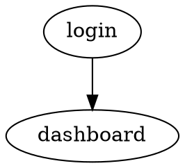
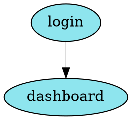
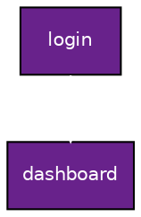

# utils/djangopwa/docs/graphviz 


### Getting Started

Install graphviz cli

```bash
brew install graphviz #macos
```

Create a simple `*.dot` file such as



Render as SVG:

```bash
dot -Tsvg view_model_plan.dot > view_model_plan.svg
```

And view with [`chafa`](https://github.com/hpjansson/chafa)

```bash
chafa view_model_plan.svg
```

To style for Light Mode consider something such as



For Dark Mode


Find more graphviz colors [here](https://graphviz.org/doc/info/colors.html)

### Motivation

> Model–view–viewmodel (MVVM) is a layer architecture design in computer software that facilitates the separation of the development of a graphical user interface (GUI; the view)—be it via a markup language or GUI code—from the development of the business logic or back-end logic (the model) such that the view is not dependent upon any specific model platform. The viewmodel of MVVM is a value converter, meaning it is responsible for exposing (converting) the data objects from the model in such a way they can be easily managed and presented. In this respect, the viewmodel is more model than view, and handles most (if not all) of the view's display logic. The viewmodel may implement a mediator pattern, organizing access to the back-end logic around the set of use cases supported by the view.

[Model view viewmodel](https://en.wikipedia.org/w/index.php?title=Model%E2%80%93view%E2%80%93viewmodel&oldid=1344184593)
